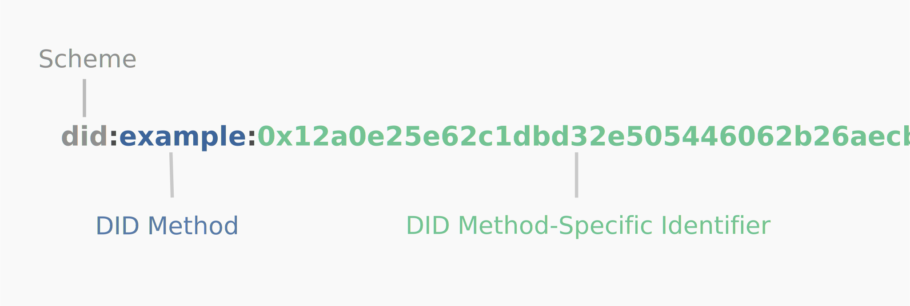

What is a DID Methods explain...

### Supported DID Methods

### `ethr-did`

Ethr-DID provides a scalable identity method for Ethereum addresses that gives any Ethereum address the ability to collect on-chain and off-chain data. Because Ethr-DID allows any Ethereum key pair to become an identity, it is more scalable and privacy-preserving than smart contract based identity methods.

This particular DID method relies on the Ethr-Did-Registry. The [Ethr-DID-Registry](https://github.com/uport-project/ethr-did-registry) is a smart contract that facilitates public key resolution for off-chain (and on-chain) authentication. It also facilitates key rotation, delegate assignment and revocation to allow 3rd party signers on a key's behalf, as well as setting and revoking off-chain attribute data. These interactions and events are used in aggregate to form a DID's DID document using the Ethr-Did-Resolver.

[Ethr-Did Github](https://github.com/uport-project/ethr-did)

[Veramo Plugin API](/docs/api/did-provider-ethr)

### `web-did`

A short paragraph explaining what a Web DID is

[Web-Did W3C Spec](https://w3c-ccg.github.io/did-method-web/)

[Veramo Plugin API](/docs/api/did-provider-ethr)

### `key-did`

A short paragraph explaining what a Key DID is

[Reference 1](/docs/veramo_agent/did-methods)

[Reference 2](/docs/veramo_agent/did-methods)

### `nft-did`

A short paragraph explaining what a NFT DID is

[Reference 1](/docs/veramo_agent/did-methods)

[Reference 2](/docs/veramo_agent/did-methods)
